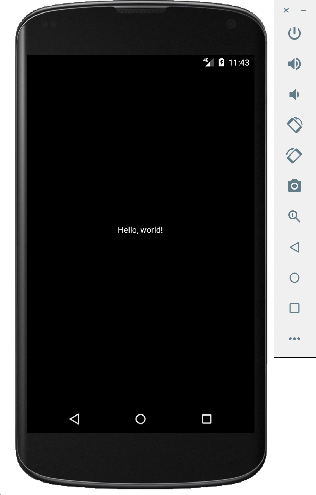
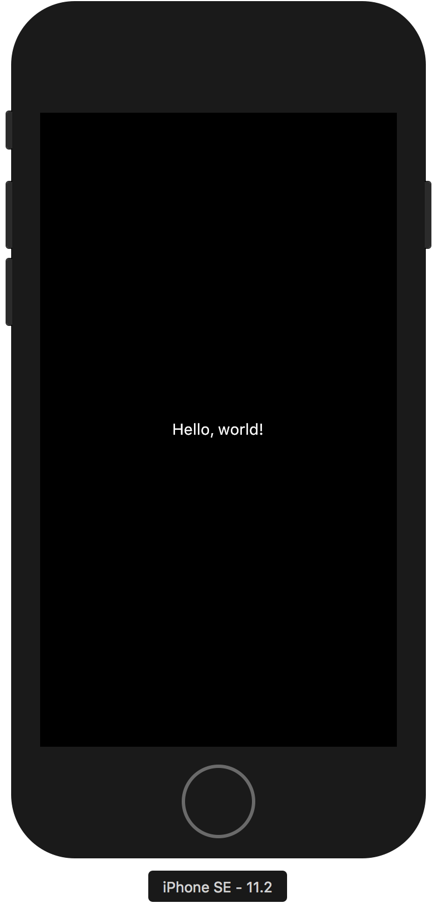

# Flutter 시작하기

Flutter는 구글에서 만드는 크로스플랫폼 어플리케이션 프레임워크입니다.
google의 `Dart`라는 언어를 이용해서 개발합니다.

React-Natvie의 대항마가 될 수 있을지 궁금해서 공부를 천천히 해 봅니다.
저는 맥 환경에서 개발을 진행합니다.

## Flutter 설치

[Flutter 공식 문서][flutter_mac_install_guide]를 가서 SDK를 받습니다.

그 이후에 SDK를 원하는 디렉토리에 `unzip` 시킵니다.
저는 `~/dev-setting`에 압축 해제 하였습니다.

압축해제 이후에, `.bash_profile`에 path 설정을 해 주어야 합니다.
제 Flutter SDK의 위치가 `~/dev-setting`이므로, `.bash_profile`에서는 아래와 같이 수정하였습니다.

``` bash
export PATH=~/dev-setting/flutter/bin:PATH
```

## iOS setting

iOS에서 Flutter 앱을 실행시키기 위해서는 당연히 맥이 필요하며, Xcode 9.0 이상 버전이 설치되어있어야 합니다.

Xcode만 9.0 이상의 버전만 설치되어있다면 뭐 특별히 설정 해 줄건 없군요.

## Android setting

안드로이드 스튜디오가 설치되어있어야 합니다. Flutter 앱을 개발하기 위해서는 최신의 Android SDK, Android SDK Platform-Tools, and Android SDK Build-Tools이 필요로 합니다.

Flutter 앱은 API level 16 이상에서만 구동 가능합니다.

기존에 안드로이드 개발 환경과 마찬가지로 PATH를 잘 적어줍니다..

## Flutter 앱 구동해보기

우리가 받은 SDK에 example들이 있기때문에, `SDK설치디렉토리/flutter/example/hello_world`에 가서 hello_world sample을 한번 구동시켜보겠습니다. 

Flutter 앱 실행은 간단합니다. Flutter 프로젝트에 들어간 다음, iOS simulator 또는 android virtual device를 실행시킨 다음, `flutter run` 커멘드를 터미널에 칩니다.




똑같은 화면이 뜨는것을 볼 수가 있습니다.

# 마무리

1. React-Native 와 매우 흡사한 느낌을 받았습니다. (Hot loading, terminal 사용 등등)
2. 빌드 타이밍은 React-Native 와 비슷한 정도인거 같습니다. 더 큰 프로젝트를 돌려봐야 체감해 볼 수 있을 것 같습니다. 그래도 나온지 얼마안된 베타치고는 이정도면 박수 짝짝짝.
3. 아직까지 CLI가 없는게 아쉬운 부분입니다.
4. Dart를 잘 쓸수 있을지, 즉 러닝커브에 대한 걱정이 조금식 들기 시작합니다.


[flutter_mac_install_guide]: https://flutter.io/setup-macos/